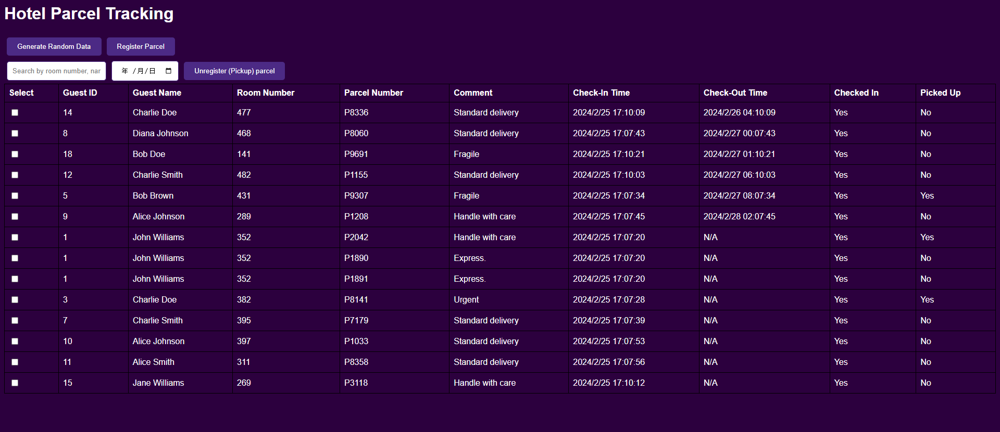

# Parcel Management System



This Hotel Parcel Management System is a web application built with Next.js, designed to streamline the process of managing parcels for hotel guests. It provides a user-friendly interface for hotel staff to register, track, and handle the pickup of parcels, ensuring efficient and accurate parcel delivery services.

## Project Status

Please note that this project is a prototype and was created for demonstration purposes as part of a coding challenge. While it illustrates my skills in software development, it is not intended for actual use in a production environment and may require further development to meet industry standards.

## Features

- Register new parcels for guests
- Track parcel status
- Manage guest check-ins and check-outs
- Unregister parcels upon guest pickup

## Getting Started

To get the development server running locally:

```bash
npm run dev
# or
yarn dev
```
Navigate to http://localhost:3000 in your web browser to view the application.

## API
The frontend interacts with a RESTful JSON-API for all backend operations. 
The backend API should be servered at http://localhost:8000.
For more information on API endpoints and usage, refer to the backend API project.

## Usage
Click Generate Random Data a few times to generate a random set of data. Then test the search filter, register parcel, unregister parcel functions.